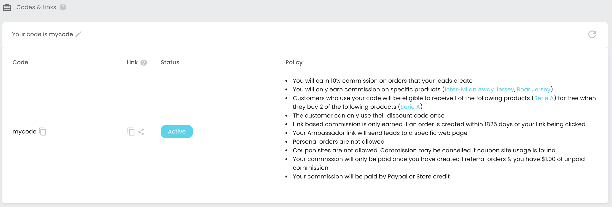
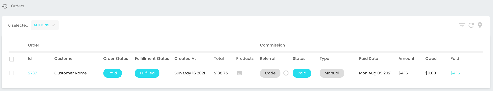

You earn sales commission on all non-personal orders that are created using either your influencer link or code.

## Where is my influencer link / code?

When you join a store's marketing program, you'll be issued a unique influencer link and code. You can find both your link and code on your dashboard, simply scroll down to the `Codes & Links` section. 

The `policy` section, describes your sales commission rate and rules for using your code. 

To copy either your influencer link or code, click the `copy icon` (square shape) in the table. You can then paste your copied link/code to your preferred marketing medium (i.e. your social media channels, your blog, email campaigns etc).

## How do I create product/page specific influencer links?

If you want to create custom influencer links that target specific products/collections/pages or blog posts of the store, then you can do so as follows:

### Product specific link

E.g. [https://paperlike.com/discount/**YOUR-CODE-HERE**?redirect=/products/paperlike-for-ipad](https://paperlike.com/discount/code?redirect=/products/paperlike-for-ipad)

This link is created, by taking an existing product page URL (e.g. https://paperlike.com/products/paperlike-for-ipad) and changing it into the above format using your influencer code.

Important: 

- The `?redirect=/` parameter must have a forward slash (`/`)
- If your influencer code was `sarah`, you must replace `discount/YOUR-CODE-HERE` with `discount/sarah`.
- URLs are always lower case

### Collection specific link

You can also create links to product collection pages. E.g.

[https://lianox.com/discount/**YOUR-CODE-HERE**?redirect=/collections/bts-merchandise](https://lianox.com/discount/code?redirect=/collections/bts-merchandise)

### Page/blog specific link

You can also create links to pages/blog posts. E.g.

[https://lianox.com/discount/**YOUR-CODE-HERE**?redirect=/pages/page-name-here](https://lianox.com/discount/code?redirect=/pages/page-name-here)

### What happens when someone clicks this link?

- Your code will be automatically added to the customer's shopping cart (unless the store has disabled this behaviour)
- We will create a `lead event` that tracks the customer who clicked on your link 
- The `?redirect=/products/`, `?redirect=/collections/` or `?redirect=/pages/` parameter is important. This will redirect the person who clicks the link, to the page that you want to take them. You must include a `/` in front of `products`, `collections` or `pages`.
- If you want to add additional URL parameters, add them to the end of the URL using the following format: `&my_param=some_value`. The `&` is required.

## What is my account status? Is my account approved?

Your dashboard shows your status. Your status can be either:

- **Approved**: You're ready to start marketing and earning! You account's code and link will only work if your account status is `approved`. 
- **Pending approval:** This means that your account is pending approval by the store. Please wait for the store to approve your account before using your code or link. Store's usually take 48 hours to review new accounts. Once approved, you will be notified by email. The vwa.la in-app chat team (technical support) can not approve your account.
- **Suspended:** If the status is suspended, the store has revoked your access and your code and link have been disabled. E.g. if your code is found on a coupon site, it will be suspended.

## How do I earn commission?

Sales commission is credited to you when:

- A customer makes an order using your influencer link or;
- A customer makes an order using your influencer code and;
- The order is paid by the customer and not cancelled
- Personal orders (orders you make yourself) don't earn commission

## How does link tracking work?
We use cookies, local storage and IP matching to track your leads (people who click on your link). These trackers exist for 30 days and then expire. This is consistent with the majority of influencer marketing products on the market today.

## When someone clicks my link is my influencer code added to their cart?
Yes, your influencer code is automatically added to the customers' cart when they click your influencer link. This approach simplifies their shopping experience and increases your conversion rate.

## Does the customer receive a discount when using my influencer code?
Usually, the customer will receive a discount when they use your influencer code. See the `policy` within your dashboard's `Codes & Links` section for more details.

## How is my commission calculated?

When an order is received, our commission tracker 1) correlates the order to an influencer's link or code and if a match is found 2) we then use the store's current commission policy to calculate commission owed (see your dashboard's `link/code table > policy` section). Commission is calculated using the net order total (after taxes, shipping, discounts, credit card fees are deducted). If an order is refunded or changed, your commission will be re-calculated based on the new order net value.

E.g.

- Your influencer commission is 10% and when customers use your influencer code, they get a 20% discount.
- You've referred Sarah from Instagram and she has created an order with the store worth $100. After taxes, shipping, discounts, processing fees are excluded, the net order value is $70. 
- Your commission is calculated as 10% of $70. Which is $7.

## How can I track my commission?

You can view all orders that your influencer account has generated from the vwa.la > Orders page. From this page, you'll be able to see:

- The order you created
- The order's value
- The order's status
- Your commission (amount owed / paid)

## What happens if a customer returns a product or changes their order?

We only allow commissions to be paid out for orders that have been fulfilled and are at least 30 days old. This prevents incorrect commission payments from being made. We also track the full life-cycle of orders. This means that we track order changes, refunds and cancellations so you can be assured that influencer rewards are always correctly calculated.