Customise the appearance and behaviour of your vwa.la marketing program

All customisation can be done from your dashboard via the `customise` page.

You can customise:

- Your branding (logo and primary brand colour)
- The appearance and behaviour of your in-store signup page launcher (button) and signup page
    - Visibility, position and text
    - Custom T&Cs approval checkbox
- Business and notification rules that change the behaviour of your influencer marketing program
- Customise your email templates
- Setup integration with:
    - Mailchimp
    - ActiveCampaign
    - Klaviyo
    - Omnisend
    - ReCharge
    - PayPal
    - Google Analytics

## Your branding

You can change the logo and primary colour of your vwa.la dashboard, in-store signup page and sign-up page.

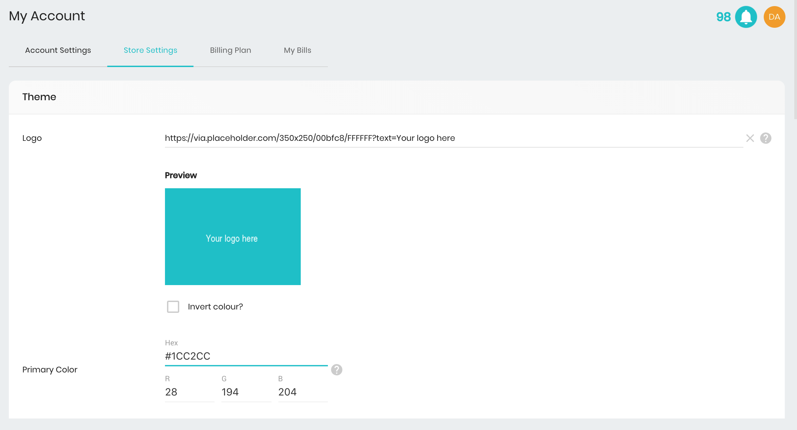

**The Logo image** must be a URL. We recommend that you re-use the logo from your store page that is being hosted by [http://cdn.shopify.com.](http://cdn.shopify.com) To get the URL, go to your store page and right-click on your logo image. Then copy and paste the URL into the vwa.la `customise` page. You will see a preview if successful. Make sure you prefix the URL with http:// or https://.

**The primary color** must be a dark color as white text will be displayed on top of it. It will be used in both the sign-up page and the launcher's 'call to action' button. To find your colour, you can use [http://www.color-hex.com/.](http://www.color-hex.com/)

And here are the results!

### Variant: Themed In-store signup page (embedded in your store)

Our in-store signup page allows your influencers to signup, login and use their marketing dashboard from within your store. When you customise your vwa.la theme, these pages will appear as follows:

    Example theme color: green

**Launcher (bottom right)**

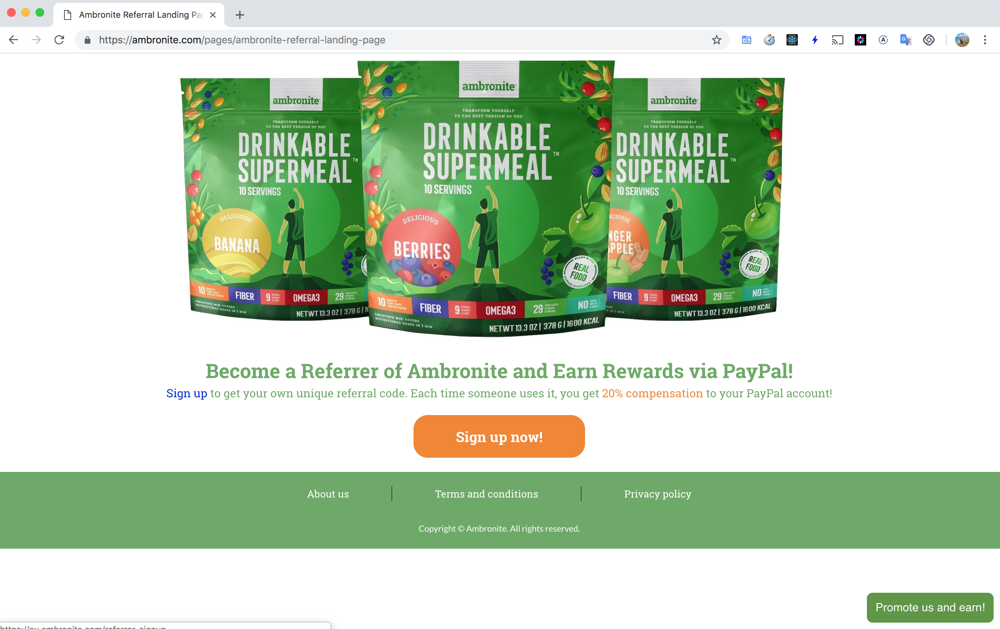

Note: The launcher is optional/configurable. See below for details.

**Signup/login page**

When your in-store signup page launcher is clicked, your influencer signup/login page will appear as follows.

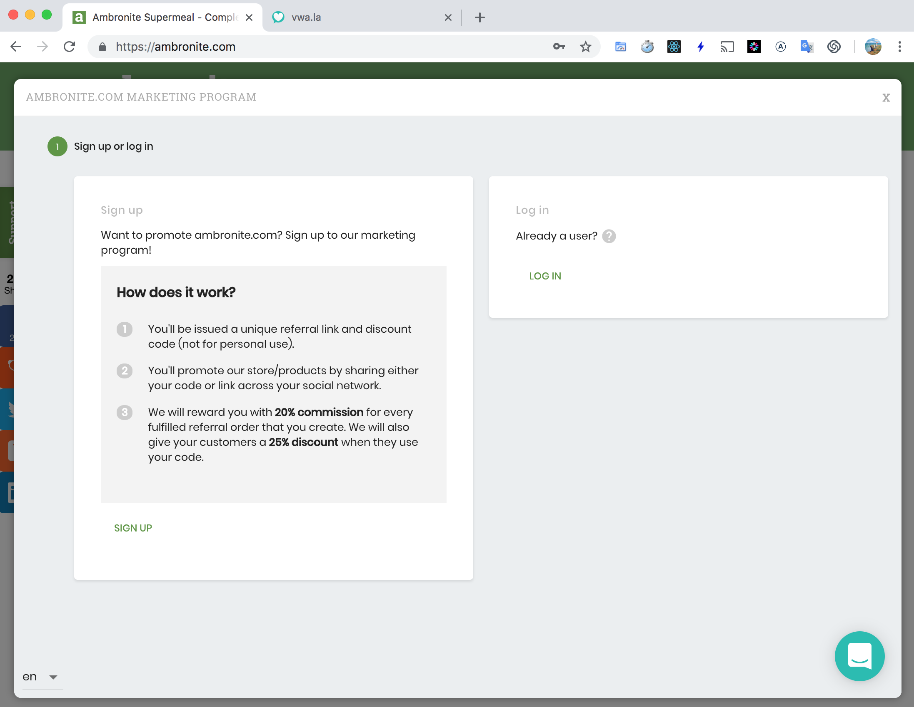

### Variant: Themed influencer signup/login page (not embedded)

If you share your influencer signup link to potential influencers, the influencer signup/login page will appear in a full browser window as follows:

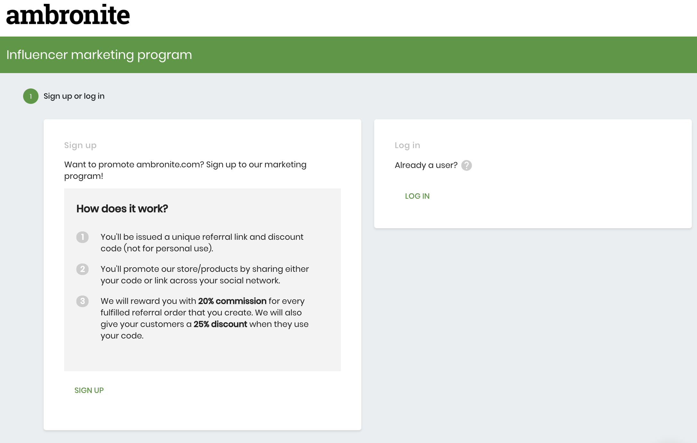

## Signup page launcher button

When you install vwa.la, we automatically install our in-store signup page launcher into your store front. This is to help you quickly set up a way to promote your influencer marketing program to potential influencers. When someone clicks the launcher, your influencer signup/login page will appear. The launcher is optional and configurable. You can:

- Enable/disable it on either desktop/mobile devices
- Change it's position and;
- customise it's text

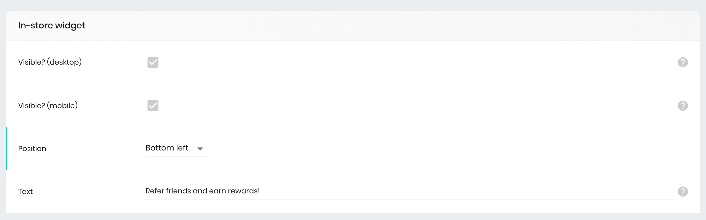

**My changes are not visible?**
It can take a few minutes before your launcher changes are applied. Please wait a few minutes and then refresh your store page. You will need to clear your browser cache to see the changes.

**Are there any alternatives to using the launcher?**
Yes. You can disable the launcher on desktop/mobile devices and then instead [add a Shopify Page to your store.](/merchant/adding-a-page-to-your-store)

## Business rules

You can change the behavior of vwa.la in the business rules section (`customise`). Please see the tool-tips within the forms for more detail.

**General rules**

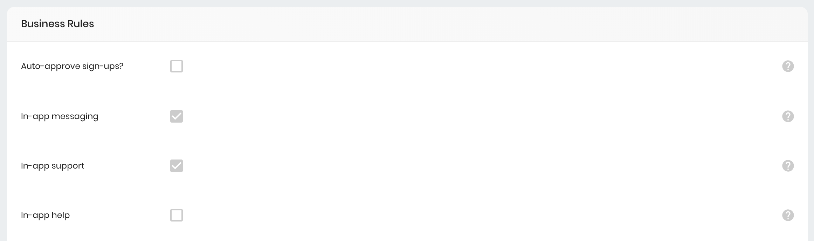

**Commission tracking rules**

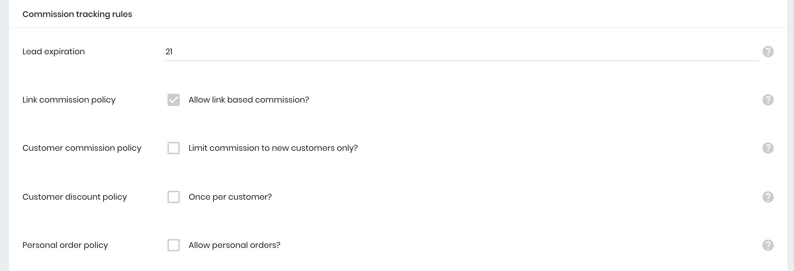

**Commission payment rules**

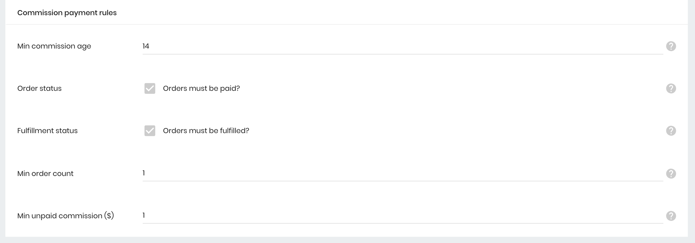

## Notification rules

You can change which events trigger an email to be sent.

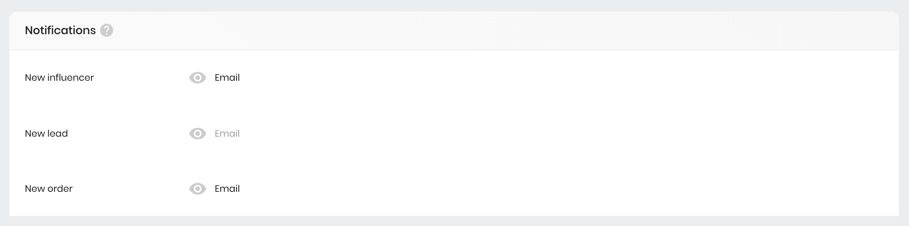

## Marketplace rules

We offer brands and influencers a marketplace to discover each other. You can remove your store from the market here (i.e. disable 'show to influencers').

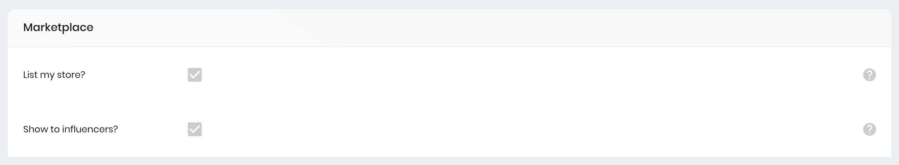

## Email templates

In this section, you can customise the email templates that we send to your influencers.

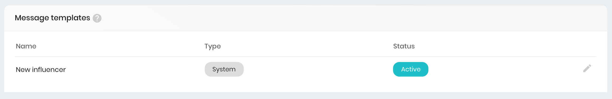

Our templates support variables as well as HTML tags (i.e. you can embed images, gifs, bold text etc). Below are a few examples that may be useful.

**Adding images**

```

```

**Adding video**

The best solution to adding video to your email templates, is to simply include the video URL as plain text. This is because the majority of email programs (i.e. gmail, outlook) do not support video in email. [Read more here](https://www.emailonacid.com/blog/article/email-development/a_how_to_guide_to_embedding_html5_video_in_email/). If you wish to use HTML to embed your video regardless, then the following example is your best approach - it will render a fallback image if your video is blocked.

```
<video src="https://www.w3schools.com/html/mov_bbb.mp4" width="320" height="176" controls>
    <a href="https://yourwebsite.com" >
        
    </a>
</video>
```

## Email marketing integration

You can sync your influencer data to Mailchimp, Klaviyo, ActiveCampaign or Omnisend. If your preferred platform is not supported reach out to us. You can also export your influencer data to CSV from the influencer page.

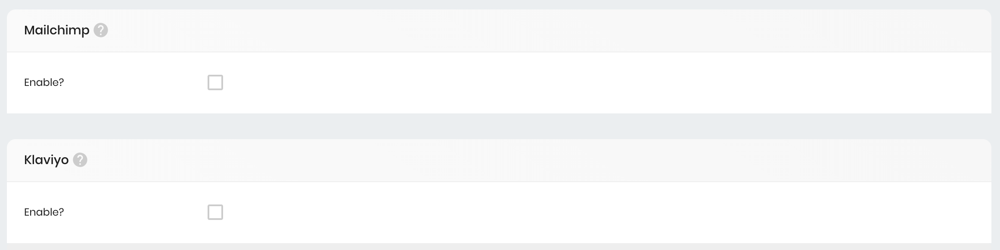

If you need anything else, reach out and let us know
