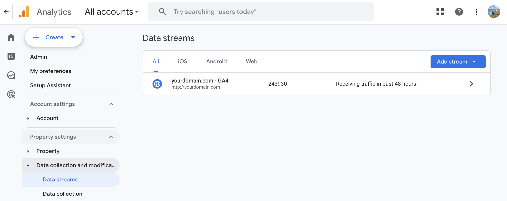
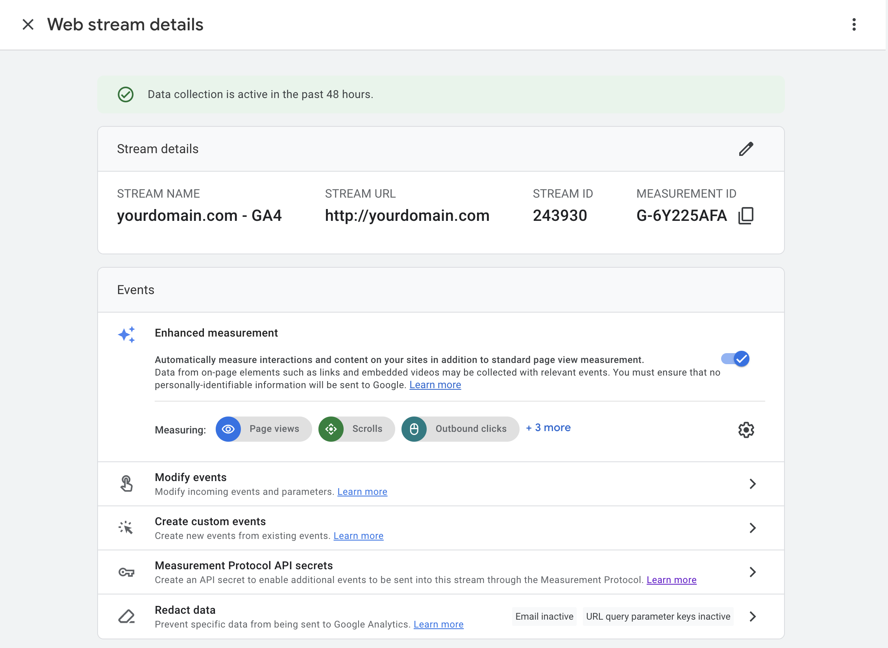
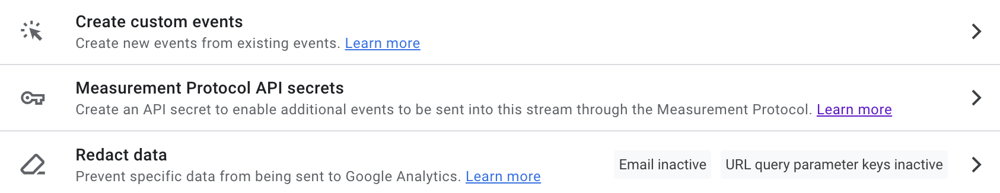
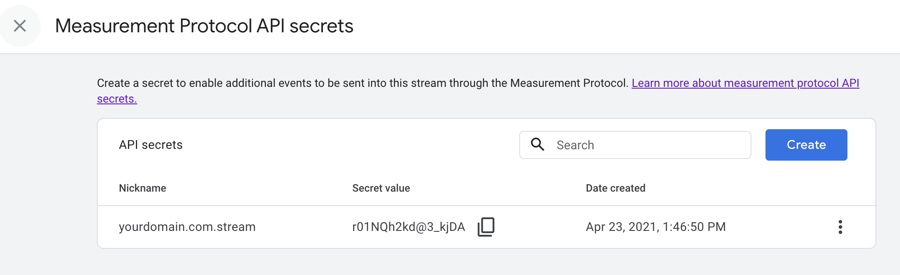
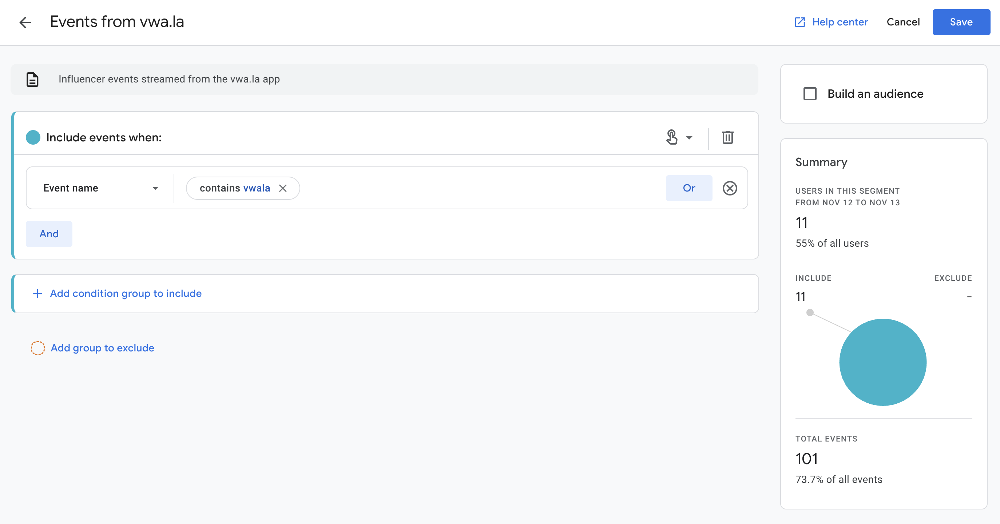
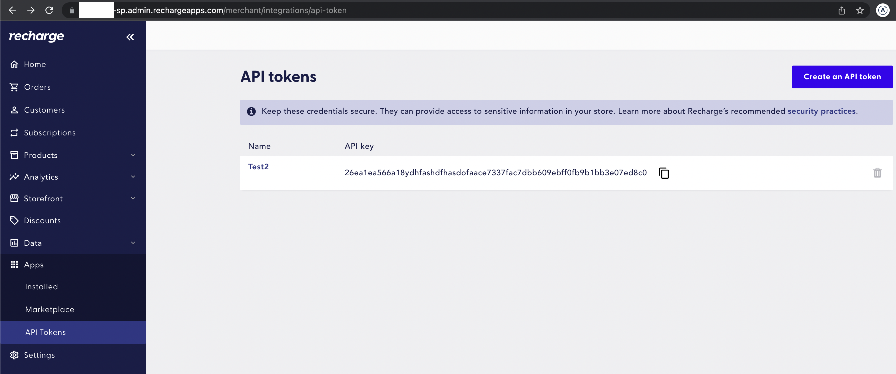
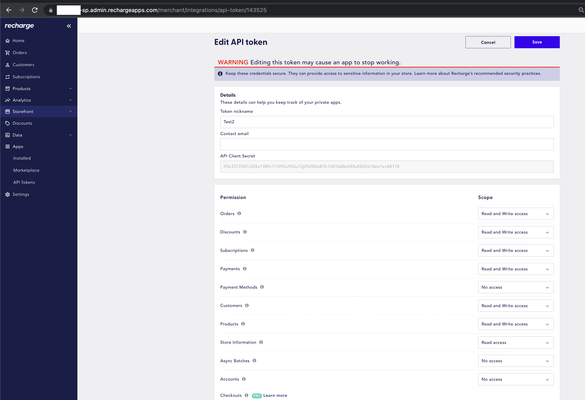

We support the following 3rd party app integrations.

## Google analytics 4+

You can enable real-time synchronisation of events from vwa.la to your Google Analytics account. You can then use these events within your Google Analytics account to measure performance and create custom reports. 

### Events 
We send the following events to Google Analytics:

- New influencer
- New lead
- New order

Important:

- We prefix all events sent to Google Analytics with `vwala`. So you can easily create segmentation rules to filter events within your reports.
- Events received by Google Analytics are not immediately visible within reports. Google can take between 24-48 hours to prepare new events for use within your reports.

### Setup 

To enable synchronisation, you must:

1. Create a Google Analytics `Web Stream` to obtain a `Measurement Id` and then create a `Measurement Protocol API secret`
1. Copy/paste the `Measurement Id` and  `Measurement Protocol API secret` into your vwa.la dashboard's `customise > Google Analytics` section

#### Setup step 1: Google Analytics setup

- Create a Google Analytics account (analytics.google.com) and then create or configure a web stream for your website's domain (i.e. yoursite.com). A web stream enables web browsers (or web apps like vwa.la) to send events to your Google Analytics account.
- Every Google Analytics web stream has a unique identifier called a `Measurement ID`. 
    - You will need to provide us with your `Measurement ID` so that we can send events to your Google Analytics account (See Figure 1 and 2 below).
    - You will also need to provide vwa.la with permission to send events to your web stream. This is done by creating a `Measurement Secret` (See Figure 3 and 4 below).

##### Figure 1: Google Analytics > Streams
Using the Google Analytics menu, go to the `Admin` page (bottom left of menu). Then go to `Property Settings > Data Collection... > Data Streams`. You must have a web stream for your domain here. Create one if it does not exist. Please see the Google Analytics help for more information on creating streams.

##### Figure 2: Google Analytics > Stream Details
When you open a stream, you will find the `Measurement Id`

##### Figure 3: Google Analytics > Stream  Measurement API Secret
To get your stream's API secret, click on the `Events > Measurement Protocol API secret` section. Then copy the `secret value` from this page

##### Figure 4: Google Analytics > Stream  Measurement API Secret

#### Setup step 2: vwa.la setup

- Go to your vwa.la dashboard's `customise` page and scroll to the `Google Analytics` section. 
    - Click `Enable`
    - Paste your Google Analytics `Measurement Id` and `Measurement Protocol API Secret` 
    - Click `save` to save your changes. 

### Reporting example

Creating reports within Google Analytics is a complex topic, please follow the Google documentation for advice. 

The following steps however document how to create a basic report:

- In the Google Analytics menu, go to the `Explore` section 
- Create a new `Exploration` (i.e. a custom report)
- The report builder form, requires you to specify one or more `Segments`, `Dimensions` and `Metrics`. 
- A segment filters events. So you will first need to create new segment that filters your Google Analytics events (i.e. to only include events sent from the vwa.la app) please see the following screenshot. 
- You can add this segment to your reports (drag drop into report builder).
- You can then use any dimension/metric as per your reporting requirements.

## Email marketing

### Mailchimp

You can automatically sync your influencer list (and their marketing performance stats) to Mailchimp. You can set this up via `customise > mailchimp`. Your data will be automatically synced twice per day.

Your mailchimp list will contain the following influencer fields:

<code>
    First name
    Last name 
    Email
    Group
    Code

    Stats
    vCount: Number of leads
    vuCount: Number of unique leads
    oCount: Number of orders
    oSum: Total sum of all orders
    oConvPc: Lead to Order conversation ratio
    cSum: Total commission earned for all orders
    cunCount: Number of orders by new customers
    curCount:  Number of orders by returning customers
    cuRatioPc: Ratio of new to returning customers 
    mrCount: Number of social media followers
</code>

### Klaviyo

You can automatically sync your influencer list (and their marketing performance stats) to Klaviyo. You can set this up via `customise > klaviyo`. Your data will be automatically synced twice per day.

### ActiveCampaign

You can automatically sync your influencer list (and their marketing performance stats) to ActiveCampaign. You can set this up via `customise > ActiveCampaign`. Your data will be automatically synced twice per day.

### Omnisend

You can automatically sync your influencer list (and their marketing performance stats) to Omnisend. You can set this up via `customise > Omnisend`. Your data will be automatically synced twice per day.

### Other

If your provider is not supported let us know. Otherwise, we have solved integration with 3rd party email solutions in a general way. All you need to do is export your influencers from vwa.la and import them into your email program of choice. See [exporting your data](/merchant/exporting-your-data/) for details on how to do this.

## ReCharge

We support integration with ReCharge. To enable integration, you must 1) create a ReCharge API token and 2) sync your influencer shopify discount codes with ReCharge. 

### Step 1: ReCharge API token
This token is a credential that allows vwa.la to listen to your ReCharge orders. Vwa.la requires this capability, so that we can track influencer commission by customer IP address and discount code.

- Log into your ReCharge account and create an API token. Please follow their documentation carefully https://docs.rechargepayments.com/docs/recharge-api-key. 
- A API token has 2 parts. A key (public ID) and a secret (i.e. password). We encrypt your password on save.
- In ReCharge, after you have created your token, you must set the token's permissions to match the screenshot below. Otherwise our integration will not work.
- After you have created your ReCharge API token, you must copy and paste the key and secret into your vwa.la `customise > ReCharge` form. 
- In vwa.la, click TEST to confirm your token is valid. Then click SAVE. 

### Figure 1: Your token KEY

### Figure 2: Your token SECRET and permissions

Your permissions must match this screenshot

### Step 2: Sync Shopify influencer discount codes with ReCharge

ReCharge does not use your Shopify discount codes, instead it requires you to duplicate your discount codes in your ReCharge admin console. 

This requirement is documented here: https://support.rechargepayments.com/hc/en-us/articles/360008830533

<code>
From the ReCharge documentation above: If you are using the Shopify Checkout Integration, you must create your discount code in both Shopify and Recharge. If the settings in Shopify and Recharge are in conflict, on recurring orders Recharge will give precedence to the settings in Recharge.
</code>

Therefore, if you want your influencer's to earn commission when a ReCharge subscription order uses their code, you must manually re-create your influencer codes in ReCharge. The documentation above, documents the different ways your can do this. I.e. either manually, or using ReCharge's discount code CSV bulk import feature.

### Limitations

## Wordpress

If your store front is a Wordpress website and not a fully featured Shopify store, it is important to note that vwa.la will work, but will work with limited functionality. This is because Wordpress lacks the integration capabilities that we require to provide our full suite of features. 

The following features will work with wordpress:

- Influencer commission tracking via discount code
- Influencer sign ups via a URL
- Influencer dashboard / management 

The following features will not work with wordpress:

- Influencer links and link based commission tracking
- Embedding our influencer signup/login/marketing dashboard within your store front. 

## Other
We also support the following 3rd party services:

- Selly
