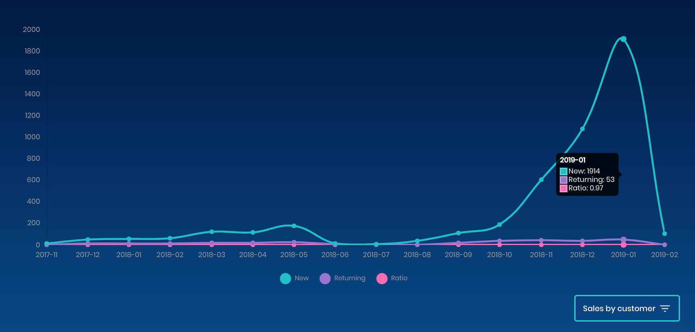

Hi all, happy new year!

In this release, we have:

* Added Klaviyo support. You can now sync your influencer data to a Klaviyo mailing list.
* Improved our email templates. They are now cleaner and branded with your store logo (to set your logo, go to `customise > theme`).
* We have begun adding social media integration! As a first step, your influencers can now link their Instagram account to their profile. This is useful for analysing their market reach and reviewing their marketing activity. We will continue to improve our social media integration over 1Q 2019.
* We've added location to each influencer's profile. Location is behind calculated using IP geo-location.
* You can now track which influencer orders are from new/returning customers (see screen below).
* You can now pay influencer commission from the influencer page.
* We've added integration for users of the Selly app.
* We now include each influencer's email address in our commission payment receipts. This is especially useful for manual payments.
* Our multi-language support has improved. Most of the app is now localised. We support French, German, Spanish, Portuguese, Chinese and English. As native English speakers, we have done our best to translate the app. If you find issues and would like to contribute, you are welcome to do so. Our translation files are hosted here, with instructions on how to make edits. [https://github.com/vwala/il8n](https://github.com/vwala/il8n)
* We've rebranded! We now have new branding across our social media presence and public facing web pages.
* We've optimised our stats and lead batching logic to be faster and capable of handling much larger volumes of data.
* We've upgraded our backend server technology to the latest version. This is part of our constant commitment to ensuring our tech is always using the latest and greatest.

Thanks all for the feedback. If you need anything let us know :)

